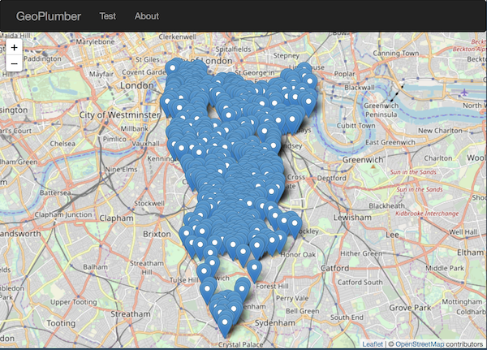

# geoplumber &middot; [](https://travis-ci.org/ATFutures/geoplumber) [](https://codecov.io/gh/ATFutures/geoplumber) [](https://www.repostatus.org/#wip) [](#)


<!-- README.md is generated from README.Rmd. Please edit that file -->

```{r setup, include = FALSE}
knitr::opts_chunk$set(
  collapse = TRUE,
  comment = "#>",
  fig.path = "man/figures/README-",
  out.width = "100%"
)
```

geoplumber is an R package which enables data scientists and developers in general to develop scalable geospatial web applications. It is work in progress, and right now we consider it an R powered web application "framework". It utilizes [`plumber`](https://github.com/trestletech/plumber), which was designed for creating web APIs with R which is Swagger compliant. It supports [React](https://reactjs.org/) frontends at present (it may support other frontend frameworks such as VueJS in the future) and geographic data, building on [`sf`](https://github.com/r-spatial/sf).

In other words, geoplumber is a lightweight geographic data server, like a barebones version of [GeoServer](http://geoserver.org/) but with a smaller footprint (< 5MB rather than > 50MB download size) and easier installation, especially if you are already an R user. There is internal discussions on the choice of a spatial database (PostgreSQL, MongoDB etc) but the package is just too young for this.

It can be installed with the following command as it is not yet on CRAN:

```{r install_github, message=FALSE, results=FALSE}
devtools::install_github("ATFutures/geoplumber")
#> got the lastest dev version
```


## geoplumber stack

We have worked with Shiny and  [`plumber`](https://github.com/trestletech/plumber/) and we consider ourselves experienced in ReactJS, too. In order to put together a web application powered at the backend with R and React at the front-end, there is a lot of setup and boilerplate to put together. This would be also correct for other front end stack such as Angular or VueJS.

Currently geoplumber uses Facebook's `create-react-app` (CRA) npm package to deal with underlying app management (including building and running) to keep you up to date with updates. `geoplumber` will generally provide detailed installation instructions for all required `npm` packages, but if not, the following are minimally required:

```
sudo npm i -g create-react-app
```


<!-- ## Installation -->

<!-- Currently repo is available only on github. To install the package using `devtools`: -->


<!-- geoplumber, like `devtools` and similar packages works by working directory. It does not currently create an `.Rproj` file but may do so in future. -->


### npm packages used
The following are included by default, the versions are just from old .Rmd file. geoplumber updates these as the package is developed. Feel free to replace it with your own .json package definer as and when.

```{r, echo=FALSE}
data <- read.csv(text=
    "package                , Usage
    create-react-app        , main package to manage front end
    enzyme                  , test suite
    enzyme-adapter-react-16 , test suite adapter for React
    leaflet                 , current default web mapping library 
    prop-types              , React bits and pieces
    react                   , React
    react-bootstrap         , bootstrap is current choice.
    react-dom               , React
    react-leaflet           , React wrapper around leaflet above
    react-leaflet-control   , React map control
    react-router            , React router (RR) 
    react-router-dom        , React dom for RR
    react-scripts           , main package to manage front end
    react-test-renderer     , test suite
    sinon                   , test suite")
```

```{r kable-npm}
knitr::kable(data)
```


## Usage
* For more detailed introduction see the [vignette](https://atfutures.github.io/geoplumber/articles/geoplumber.html)*

To create a new web application:
```{r hidden1, echo=FALSE, eval=TRUE}
knitr::opts_knit$set(root.dir = tempdir())
```
```{r create-example, eval=FALSE}
library(geoplumber)
gp_create("my_app")
```
This will create a `my_app` folder at your current working directory. Suppose you started an R session from a folder with path `/Users/ruser/`, you will have `/Users/ruser/my_app` on your machine. 

Please note that the folder should be either non-existent (it will then be created by `gp_create()`) or empty.
If your working directory is an empty directory, you can create a geoplumber app using:
`geoplumber::gp_create(".")`.

After running `gp_create()` you might want to use `gp_rstudio("project_name")` to create an RStudio project from R's command line. You could also use RStudio's default way of creating a project within an existing directory -- or just don't create an RStudio project.

You can also give geoplumber a path including one ending with a new directory. Currently, geoplumber does not do any checks on this but the underlying CRA does.

You can then build the new project
```{r build-example, eval=FALSE}
setwd("my_app")
gp_build() # the front end and create minified js files.

```
Please note, `gp_build()` produces a production ready minifed front end. It does not have to be used everytime a little change is done to the front end, as the package is still very young, it does not have the proper development "serve" function which would use `gp_plumb_front()` but would have to also use `gp_plumb()` to serve the backend.

At this point, if you created an app using the above examples or set your working directory to a geoplumber app. You can then serve all endpoints and front end with one command:
`gp_plumb()` \# provide custom port if you wish, default is 8000

Then visit `localhost:8000` to see your app.

### Front end ###
Once the geoplumber app `my_app` has been created. It will have a `create-react-app` directory structure with an extra `R` folder to hold the backend R code. The React components, as they are in CRA apps, are in the `src` folder and ready to be customised and developed for your own purposes. So, a React developer could run `npm start` on the root directory and run the built in CRA development server which is what `gp_plumb_front()` does too.

## Example (1)
Serve the `geoplumber::traffic` dataset (data.frame) at a "/api/data" endpoint, and view it on the front end. 

The `traffic` [dataset](https://data.cdrc.ac.uk/dataset/southwark-traffic-counts) is from CDRC at University of Leeds which is traffic data locations for the larger traffic dataset.

To achive this copy the following endpoint/API to the clipboard of your machine. If you like to understand the function, you need to learn `plumber` package.

```{r eval=FALSE}
#' Serve geoplumber::traffic from /api/data
#' @get /api/data
get_traffic <- function(res) {
  geojson <- geojsonsf::sf_geojson(geoplumber::traffic)
  res$body <- geojson
  res
}
```
Then run (re-copied into clipboard just in case):
```{r hidden2, echo=FALSE}
Sys.setenv(CLIPR_ALLOW=TRUE)
```
```{r add-endpoint-manually, eval=FALSE}
setwd("my_app")
old_clip <- clipr::read_clip()
# adding above to clipboard
clipr::write_clip(c(
 "#' Serve geoplumber::traffic from /api/data",
 "#' @get /api/data",
 "get_traffic <- function(res) {",
 "  geojson <- geojsonsf::sf_geojson(geoplumber::traffic)",
 "  res$body <- geojson",
 "  res",
 "}"
 ))
gp_endpoint_from_clip()
clipr::write_clip(old_clip)
```

This has now added a new endpoint at: `/api/data`. To consume it, we can simply run:

```{r add-geojson, eval=FALSE}
setwd("my_app")
gp_add_geojson("/api/data") # param value is default
```

You can now see the data by running:
```{r eval=FALSE}
gp_build() # build changes
gp_plumb()
```
```{r, echo=FALSE, fig.align='center', out.width="70%", fig.cap="<a href='https://www.cdrc.ac.uk/'>CDRC</a> London traffic data on geoplumber"}

```
You can also now see the raw JSON dataset at  `http://localhost:8000/api/data`,
and on a map on a browser view the map at `http://localhost:8000`.

## Example (2)

We would like to see default University of Leeds `uni_poly` grow/shrink using `sf::st_buffer()` function. Here is a reproducible example (please take a look at the default `plumber.R` file in your `my_app` project):

```{r, eval=FALSE}
gp_create(tolower(tempdir()))
setwd(tolower(tempdir()))
gp_is_wd_geoplumber()
gp_add_slider(
  min = 0.001,
  max = 0.01,
  step = 0.001
)
gp_change_file(
  path = "src/Welcome.js",
  what = '<GeoJSONComponent fetchURL={"http://localhost:8000/api/uol?grow=" + this.state.sliderInput} />
',
  pattern = '<GeoJSONComponent fetchURL="http://localhost:8000/api/uol" />',
  replace = TRUE,
  verbose = TRUE
)
```

Run the project (this time at `tempdir()` location) by:
```{r eval=FALSE}
gp_build() # build changes
gp_plumb()
```

Now you can see (latest version is slightly improved than following GIF):
```{r, echo=FALSE, fig.align='center', out.width="70%", fig.cap="geoplumber::uni_poly grow/shrinking using sf::st_buffer function on server side."}
knitr::include_graphics("https://user-images.githubusercontent.com/1825120/46699371-7f79d000-cc11-11e8-9716-e1223296c7d6.gif")
```

## Showcase

An example application is deployed at [www.geoplumber.com](www.geoplumber.com). It showcases some zone and flow data using both `LeafletJS` and `MapboxGL` both in React. The application is dockerised automating the production and deployment. 

## End-points

R package `plumber` comes with a default end-point for documenting the API using Swagger. This is also available from `geoplumber`'s `/__swagger__/` path.

We follow a pattern of `/api/` before the end-points and without for other URL's.
A new web app will have `/api/helloworld` and you can `curl` it:

```{sh eval=FALSE}
curl localhost:8000/api/helloworld
#> {"msg":["The message is: 'nothing given'"]}
```

## Test

Tests currently only apply to very restricted components of full functionality.

```{r, eval=FALSE}
devtools::test()
```
