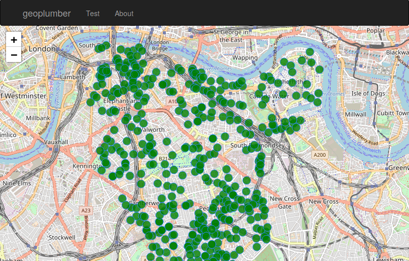

# geoplumber · [](https://travis-ci.org/ATFutures/geoplumber) [](https://codecov.io/gh/ATFutures/geoplumber) [](https://www.repostatus.org/#wip) [](#)

<!-- README.md is generated from README.Rmd. Please edit that file -->

geoplumber is an R package which enables data scientists and developers
in general to develop scalable geospatial web applications. It is work
in progress, and right now we consider it an R powered web application
“framework”. It utilizes
[`plumber`](https://github.com/trestletech/plumber), which was designed
for creating web APIs with R which is Swagger compliant. It supports
[React](https://reactjs.org/) frontends at present (it may support other
frontend frameworks such as VueJS in the future) and geographic data,
building on [`sf`](https://github.com/r-spatial/sf).

It can be installed with the following command as it is not yet on CRAN:

``` r
devtools::install_github("ATFutures/geoplumber")
#> the latest dev version
```

<!-- ## Installation -->

<!-- Currently repo is available only on github. To install the package using `devtools`: -->

<!-- geoplumber, like `devtools` and similar packages works by working directory. It does not currently create an `.Rproj` file but may do so in future. -->

## Usage

  - For more detailed introduction see the
    [vignette](https://atfutures.github.io/geoplumber/articles/geoplumber.html)

To create a new web application:

``` r
library(geoplumber)
gp_create("my_app")
```

This will create a `my_app` folder at your current working directory.
Suppose you started an R session from a folder with path
`/Users/ruser/`, you will have `/Users/ruser/my_app` on your machine.

You can then build the new project

``` r
setwd("my_app")
gp_build() # the front end and create minified js files.
```

You can then serve endpoints and front end with: `gp_plumb()` \# provide
custom port if you wish, default is 8000

Then visit `localhost:8000` to see your app.

## Example (1) reproducible web app

``` r
library(geoplumber)
d <- file.path(tempdir(), "gp")
gp_create(d)
#> Creating directory: /var/folders/z7/l4z5fwqs2ksfv22ghh2n9smh0000gp/T//Rtmpee0Wxd/gp
#> To build/run app, set working directory to: /var/folders/z7/l4z5fwqs2ksfv22ghh2n9smh0000gp/T//Rtmpee0Wxd/gp
#> Standard output from create-react-app works.
#> You can run gp_ functions from directory: /var/folders/z7/l4z5fwqs2ksfv22ghh2n9smh0000gp/T//Rtmpee0Wxd/gp
#> To build the front end run: gp_build()
#> To run the geoplumber app: gp_plumb()
#> Happy coding.
setwd(d)
ps <- gp_plumb()
#> WARNING:
#> Looks like geoplumber was not built, serveing API only.
#> To serve the front end run gp_build() first.
Sys.sleep(1) # needed on automated build machines :)
ps
#> PROCESS 'R', running, pid 24807.
require(RCurl)
#> Loading required package: RCurl
webpage <- getURL("http://localhost:8000")
webpage <- readLines(tc <- textConnection(webpage)); close(tc)
tail(webpage)
#> [1] "    <p>build missing</p>" "  </div>"                
#> [3] "</div>"                   ""                        
#> [5] "</body>"                  "</html>"
ps$kill()
#> [1] TRUE
# should fail
# getURL("http://localhost:8000")
```

## Example (2)

Serve the `geoplumber::traffic` dataset (data.frame) at a “/api/data”
endpoint, and view it on the front end.

The `traffic`
[dataset](https://data.cdrc.ac.uk/dataset/southwark-traffic-counts) is
from CDRC at University of Leeds which is traffic data locations for the
larger traffic dataset.

To achive this copy the following endpoint/API to the clipboard of your
machine. If you like to understand the function, you need to learn
`plumber` package.

``` r
#' Serve geoplumber::traffic from /api/data
#' @get /api/data
get_traffic <- function(res) {
  geojson <- geojsonsf::sf_geojson(geoplumber::traffic)
  res$body <- geojson
  res
}
```

Then run (re-copied into clipboard just in case):

``` r
setwd("my_app")
old_clip <- clipr::read_clip()
# adding above to clipboard
clipr::write_clip(c(
 "#' Serve geoplumber::traffic from /api/data",
 "#' @get /api/data",
 "get_traffic <- function(res) {",
 "  geojson <- geojsonsf::sf_geojson(geoplumber::traffic)",
 "  res$body <- geojson",
 "  res",
 "}"
 ))
gp_endpoint_from_clip()
clipr::write_clip(old_clip)
```

This has now added a new endpoint at: `/api/data`. To consume it, we can
simply run:

``` r
setwd("my_app")
gp_add_geojson("/api/data")
```

You can now see the data by running:

``` r
gp_build() # build changes
gp_plumb()
```

Or in the following “export” function a basic `leaflet` map using the
“headless” `gp_map` funciton:

<div class="figure" style="text-align: center">



<p class="caption">

<a href='https://www.cdrc.ac.uk/'>CDRC</a> London traffic data on
geoplumber

</p>

</div>

``` r
# cd into a geoplumber app
setwd("my-app/")
library(geoplumber)
# view a dataset such as the `traffic` sf object bundled 
t <- gp_map(geoplumber::traffic, browse_map = FALSE,
            height = "320px", width = "90%")
# use includeHTML for markdown
htmltools::includeHTML(t)
```

You can also now see the raw JSON dataset at
`http://localhost:8000/api/data`, and on a map on a browser view the map
at `http://localhost:8000`.

## Example (3)

We would like to see default University of Leeds `uni_poly` grow/shrink
using `sf::st_buffer()` function. Here is a reproducible example (please
take a look at the default `plumber.R` file in your `my_app` project):

``` r
gp_create(tolower(tempdir()))
setwd(tolower(tempdir()))
gp_is_wd_geoplumber()
gp_add_slider(
  min = 0.001,
  max = 0.01,
  step = 0.001
)
gp_change_file(
  path = "src/Welcome.js",
  what = '<GeoJSONComponent fetchURL={"http://localhost:8000/api/uol?grow=" + this.state.sliderInput} />
',
  pattern = '<GeoJSONComponent fetchURL="http://localhost:8000/api/uol" />',
  replace = TRUE,
  verbose = TRUE
)
```

Run the project (this time at `tempdir()` location) by:

``` r
gp_build() # build changes
r <- gp_plumb() # run in bg
r¢kill()
```

Now you can see:

<div class="figure" style="text-align: center">


<p class="caption">

geoplumber::uni\_poly grow/shrinking using sf::st\_buffer function on
server side.

</p>

</div>

## geoplumber stack

We have worked with Shiny and
[`plumber`](https://github.com/trestletech/plumber/) and we consider
ourselves experienced in ReactJS, too. In order to put together a web
application powered at the backend with R and React at the front-end,
there is a lot of setup and boilerplate to put together. This would be
also correct for other front end stack such as Angular or VueJS.

Currently geoplumber uses Facebook’s `create-react-app` (CRA) npm
package to deal with underlying app management (including building and
running) to keep you up to date with updates. `geoplumber` will
generally provide detailed installation instructions for all required
`npm` packages, but if not, the following are minimally required:

    sudo npm i -g create-react-app

### Front end

Once the geoplumber app `my_app` has been created. It will have a
`create-react-app` directory structure with an extra `R` folder to hold
the backend R code. The React components, as they are in CRA apps, are
in the `src` folder and ready to be customised and developed for your
own purposes. So, a React developer could run `npm start` on the root
directory and run the built in CRA development server which is what
`gp_plumb_front()` does too.

### npm packages used

The following are included by default, the versions are just from old
.Rmd file. geoplumber updates these as the package is developed. Feel
free to replace it with your own .json package definer as and when.

``` r
knitr::kable(data)
```

| package                 | Usage                               |
| :---------------------- | :---------------------------------- |
| create-react-app        | main package to manage front end    |
| prop-types              | React propTypes                     |
| react                   | React main                          |
| react-dom               | React DOM                           |
| react-bootstrap         | bootstrapZ                          |
| leaflet                 | current default web mapping library |
| react-leaflet           | React wrapper around leaflet above  |
| react-leaflet-control   | React map control                   |
| react-router            | React router (RR)                   |
| react-router-dom        | React dom for RR                    |
| react-scripts           | main package to manage front end    |
| react-test-renderer     | test suite                          |
| enzyme                  | test suite                          |
| enzyme-adapter-react-16 | test suite adapter for React        |
| sinon                   | test suite                          |

## Showcase

An example application is deployed at
[www.geoplumber.com](www.geoplumber.com). It showcases some zone and
flow data using both `LeafletJS` and `MapboxGL` both in React. The
application is dockerised automating the production and deployment.

## End-points

R package `plumber` comes with a default end-point for documenting the
API using Swagger. This is also available from `geoplumber`’s
`/__swagger__/` path.

We follow a pattern of `/api/` before the end-points and without for
other URL’s. A new web app will have `/api/helloworld` and you can
`curl` it:

``` sh
curl localhost:8000/api/helloworld
#> {"msg":["The message is: 'nothing given'"]}
```

## Tests

Tests currently only apply to restricted components of full
functionality.

``` r
devtools::test()
```

## Roadmap

What I (Layik) think will work for a version 0.1 to hit CRAN is
geoplumber would be able to have:

  - basic structure of a R + React app running
  - basics of a production environment via Docker
