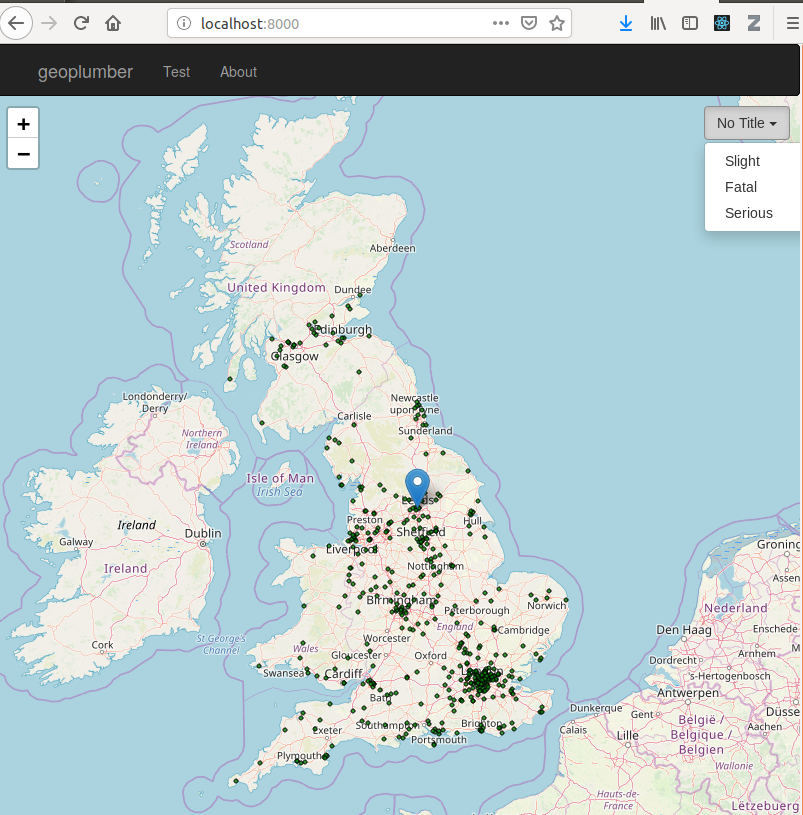

```{r setup, include = FALSE}
knitr::opts_chunk$set(
  collapse = TRUE,
  comment = "#>",
  out.width = "100%"
)
```

## Summary {-}

Data scientists, and R users in particular, tend to focus on 'back-end' data processing, with visual outputs usually generated locally. Recent developements have made it easier for R developers to deploy their applications remotely, the `shiny` package/framework being a notably example.
However, such 'pure R' approaches have limitations, especially when it comes to geographic web apps:
they are often 'pinned' to particular JavaScript frameworks/libraries/versions, and provide little for people wanting to develop web APIs.
To overcome this issue we developed `geoplumber`, an R package that provides the 'best of both worlds', leaving the front end to native JavaScript code and the back-end to R/databases.
This paper describes the approach and highlights the possibilities with a real-world example.

**Keywords:** Web Applications with R, Rpackage, JavaScript, ReactJS, Web Mapping

## Introduction

\par
\begin{wrapfigure}[10]{r}[2pt]{7cm}
\includegraphics[width=0.45\textwidth]{geoplumber-concept.png}
\caption{Running R as backend and ReactJS + LeafletJS at the frontend of a web application.}
\end{wrapfigure}

Scripting languages [@opensees] have been powering the web for a long time. The most widely used ones are not used for geospatial data processing, for example PHP [@zhao2012hiphop]. We know that Python is also a scripting language and there is Flask [@grinberg2018flask] enabling web applications in Python. 

The statistical programming language R [@rcore] is a widely used language for data science and, with packages such as `sf` enabling geocomputation.
Data scientists who use R and want to deploy their applications often wonder: how can I use R to deploy on the web?

\newpage

We found out that there had already been some work in this regard, inspired the Python package Flask, called `plumber` [@plumber]. After preliminary checks and checking the codebase, we decided that we could use `plumber` to power the project.

## Approach: Combining technologies for data science and the web

Facebook developed ReactJS [@fedosejev2015react]. The approach is designed for scalability and rapid front end development [@gackenheimer2015introducing]. These advantages, plus prior experience with React, explain our choice of frontend framework, to be combined with `plumber` in the backend.
After developing an ad-hock web app based on this approach, we found there were advantages of generalising the approach. The R packaging system makes the approach accessible to other data scientists wanting a flexible, scalable yet lightweight front-end for their R applications, and encourages testing and feedback.
`geoplumber`, which can be installed with the following command, was born.

### Geospatial web applications

JavaScript has a rich set of frontend web mapping technologies, including LeafletJS and Mapbox JS. Since the emergence of WebGL, the possibilities for creating "web application frameworks" for displaying large geospatial datasets, have increased greatly.

The package is a combination of above technologies which are loosely coupled and could be used for non-geospatial purposes. This loose coupling is done with attention, making it accessible to developers who already use ReactJS tools, without needing to engage with the R ecosystem.
`geoplumber` is compatible with the `npm` (Node Package Manager), and uses the Create-React-App (CRA) [@banks2017learning] NodeJS package for deployment.

### Interactive data analysis

A focus of `geoplumber` is interactive data analysis.
The package includes functions to support such tasks as adding React or generic JS code to a web application, taking advantage of React's modular design.
The result is a "framework" where node packages can be defined for use in the frontend and data can be served from a flexible R-based backend.

### Use case: a web app for visualising road traffic casualties

A geoplumber app, as it stands, is a standard `npm` package generated by CRA. For the API, an `R` directory containing a `plumber.R` file is added, which is used by the underlying `plumber` package. To create a `geoplumber` app:

```{r pkgs, echo=FALSE, eval=TRUE, results='hide'}
packages = c("plumber", "clipr", "remotes", 
             "dplyr", "geojsonsf")
if (length(setdiff(packages, rownames(installed.packages()))) > 0) {
  install.packages(setdiff(packages, rownames(installed.packages())),repos='http://cran.us.r-project.org')
  remotes::install_github("ropensci/stats19")
  lapply(packages, library, character.only = TRUE)
  print(getwd())
}
```
```{r gp_create, echo=TRUE, eval=TRUE}
dir_name = file.path(tempdir(), "my_app")
dir.create(dir_name)
library(geoplumber)
gp_create(dir_name)
setwd(dir_name)
gp_build()
```

The directory and files structure of a `geoplumber` applications looks like this:

\newpage

```{r dir.structure, eval=FALSE}
+- R/plumber.R       # backend code
+- README.md       
+- package.json      # npm package file
+- public            # public facing docs
+- src               # frontend JS code.
```

We can then do all our data processing straight from R and serve the data using API end-points. `plumber` works by adding tags in front of standard R functions. Lets get some data using `stats19` package.

```{r get_stats19, echo=TRUE, results='hide', message=FALSE}
library(stats19)
accidents = stats19::get_stats19(year = 2017, ask = FALSE)
accidents = dplyr::sample_n(accidents, 500)
accidents = stats19::format_sf(accidents, lonlat = TRUE)
```

For example, to geneate an end-point that returns an R object which contains JSON data in a parameter called `accidents_geojson`, we could write a function like this and add into a `geoplumber` app's `R/plumber.R` file:

```{r gp_endpoint, eval=FALSE}
#' @get /api/stats19                             # 1
all_geojson <- function(res){                    # 2
  res$headers$`Content-type` = "application/json"# 3
  res$body <- accidents_geojson                  # 4
  res
}
# copy above, run
# geoplumber::gp_endpoint_from_clip() 
# to add it into your geoplumber app
```

In the line with `# 1` comment above, the `@get` part means `/api/stats19` is going to be a HTTP GET path. The function has a `response` parameter which can be modified and returned. In this case, we set the response `content-type` and also load the body of the response object with the JSON object to be returned. Therefore, `@get /api/stats19`, translates into `http://localhost:8000/api/stats19` which would returns the `accidents_geojson` object.

In this example, `stats19` [@lovelace_stats19_2019] R package is used for data acquisition and processing. Using `stats19` we can get the crashes for years since 1979 from DfT (Department for Transport, United Kingdom). There are functions in `geoplumber` to work on the development and finally deploy our application. A screen shot of an example is shown in Table 1.

Frontend view             |  The API serving the data
:-------------------------:|:-------------------------:
\includegraphics[width=200pt]{geoplumber2.png}      |  \includegraphics[width=200pt]{geoplumber3.png}
Table 1: A geoplumber app for road casualty data. On the left, customised frontend uses Uber's DeckGL (React). On the right the same data served from `/api/stats19` end-point in R.

We can also interactively see the `accidents` object and choose a column to filter using the API from the front-end:

```{r gp_sf2, eval=FALSE}
geoplumber::gp_sf(accidents, 
                  props_list = 
                    list(accident_severity = unique(accidents$accident_severity)))
```

If you then visit `http://localhost:8000` on your broswer, it should give you something like Figure 2.

```{r geoplumber, echo=FALSE, fig.cap="STATS19 sample 500 points across the UK for year 2017. With an interactive dropdown querying R code subsetting the 500 sample dataset.", out.width = '100%'}

```

## Geospatial Databases

Although currently the work in progress repository^[See: https://github.com/ATFutures/geoplumber] does not include one, it is possible to add a database of choice to the stack. Due to the light weight Flask/plumber type of API frameworks, it is possible to make use of the full potential of R language. For example, to connect to a MySQL database running on a Linux machine, with username and password defined at the users `~/.my.cnf` file as per MySQL convenctions. We can then create API end-points that can connect to a MySQL instance with a `geoplumber` schema defined in it, using `RMySQL` and `DBI` packages as follows:

```{r, eval=FALSE}
con <- DBI::dbConnect(RMySQL::MySQL(), group = "my-db")
# we can send SQL queries such as selecting a schema
DBI::dbGetQuery(conn = con, "use geoplumber;")
#> data frame with 0 columns and 0 rows
DBI::dbListTables(con)
#> character(0)
```
Add the output of the above into another end-point:
```{r, eval=FALSE}
#' @get /api/tables
tables = function(res){
  # ...
  res$body <- tables_list_geojson
  # ...
}
```

## Deployment

Standard deployment documentation^[See https://www.rplumber.io/docs/hosting.html] for `plumber` application is provided by the developers. In our small scale deployment experience, we have deployed two separate geoplumber apps using Docker virtualization technology, using reverse proxy from a standard Nginx HTTP server. The Dockerfile and other deployment details are available on a GitHub repository^[See https://github.com/ATFutures/activeTransportToolbox].

## Acknowldgements

The work carried out is funded by Consumer Data Resarch Center (CDRC) at Leeds Institute for Data Analytics (LIDA) at University of Leeds. The open source ecosystem enables projects like Linux and can benefit geoplumber immensely. The GitHub repository on GitHub^[See https://github.com/ATFutures/geoplumber] lists all contributors to the package and interested parties are invited to collaborate further.

## References
